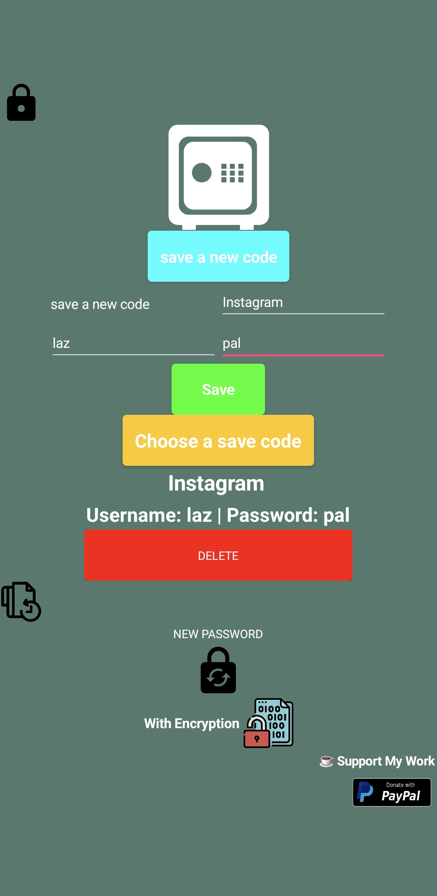

# 🔐 Local Password Manager (App Inventor)

Αυτή η εφαρμογή είναι ένας **τοπικός διαχειριστής κωδικών**, κατασκευασμένος με το **MIT App Inventor**, που επιτρέπει στον χρήστη να αποθηκεύει με ασφάλεια τους κωδικούς του στη συσκευή του.
---
### 📲 Κατέβασε την εφαρμογή (.aia)

---
## 📸 Screenshots
 

  
  
  
  
  

## 📱 Χαρακτηριστικά

- ✅ Κρυπτογράφηση **AES** των κωδικών με χρήση **Salt** και **μυστικού**
- ✅ Τοπική αποθήκευση μόνο (χωρίς internet)
- ✅ Προστασία με **κύριο κωδικό**
- ✅ **Ανίχνευση πρώτης εισόδου** χρήστη
- ✅ Ειδοποιήσεις ασφαλείας για λάθος κωδικούς
- ✅ Μοντέρνο και καθαρό UI

## 🔧 Χρησιμοποιήθηκαν

- [MIT App Inventor](https://appinventor.mit.edu/)
- MareshaAES1 Extension
- ActivityStarter (για εξωτερικά links όπως το PayPal)
- Χωρίς internet, ελαφρύ και ασφαλές

## ☕ Support My Work
- 🌐 PayPal Donate |
 If you like what I do, consider donating:

---
**⚠️ Disclaimer:** Οι κωδικοί αποθηκεύονται μόνο στη συσκευή και δεν μεταφέρονται σε κανέναν server. Ο χρήστης είναι υπεύθυνος για τη διαχείρισή τους.
---
### ✍️ Δημιουργός

- Lazpal
- GitHub: [@Lazpal](https://github.com/Lazpal)

-This project is licensed under the LAZPAL License - see the [LICENSE](LICENSE) file for details.
-© 2025 LAZPAL
-author 'lazpal'
